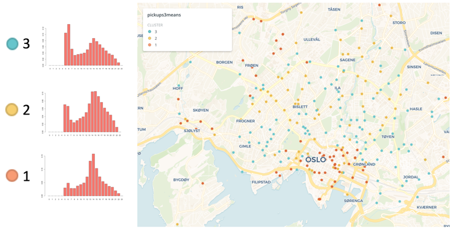

##### Final project, CYPLAN-257
##### UC Berkeley, Fall 2019

### Abstract

This paper serves as an introductory analysis of the trip dynamics in Oslo bicycle-sharing system (BSS), Oslo Bysykkel, using PCA and K-means clustering the weekday trip data of 2019, as well as some demographic information of the city. The results show that Oslo BSS is heavily influenced by a work/school commuter pattern.

### Results

#### Pickup Distributions
Each station illustrated with the color of the reconstructed center of the cluster it is in.

#### Drop-off Distributions
Each station illustrated with the color of the reconstructed center of the cluster it is in.

#### Critical Stations
Stations that are included in clusters that have incompatible pickup and drop-off distributions

You can learn more at [the projects github page](https://github.com/olatar/OsloCityBike-Analysis).

